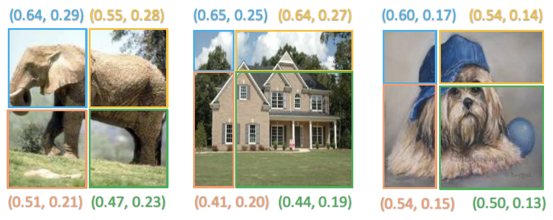
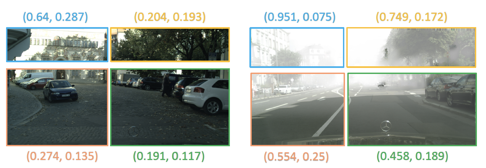
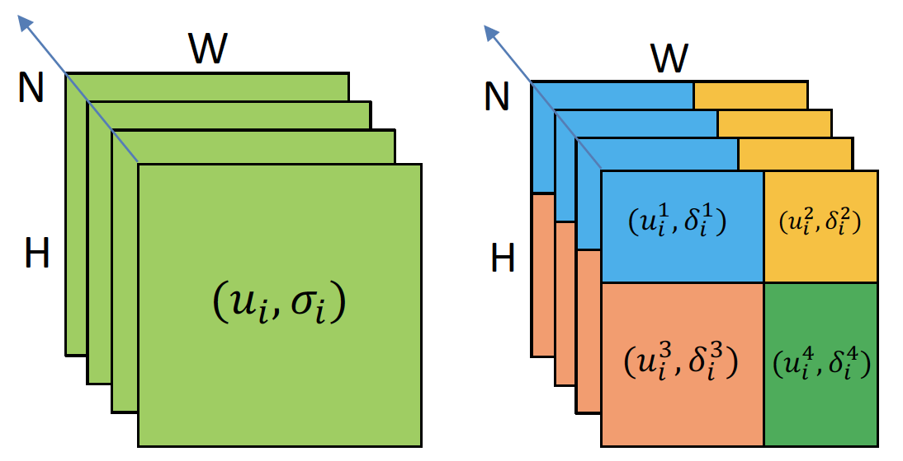

# PBN
The official codes of our paper: [Patch-aware Batch Normalization for Improving Cross-domain Robustness](https://arxiv.org/abs/2304.02848)

**One Sentence Summary:** This paper proposes a patch-aware batch normalization method to improve model generalization by leveraging differences between local patches within images. Experiments show effectiveness on various vision tasks.

|                                     |
|:---------------------------------------------------------------:|
| Fig.1: Images for classification. |


|        |
|:---------------------------------:|
| Fig.2: Images for detection and segmentation. |

|                                                                                |
|:------------------------------------------------------------------------------------------------------------:|
| Fig.3: Comparison between the typical batch normalization(BN) and our patch-aware batch normalization (PBN). |


In our paper, we have demonstrated the effectiveness of our proposed patch-aware batch normalization (PBN) method on four tasks: image classification, object detection, instance retrieval, and semantic segmentation. The source code for reproducing the image classification experiments can be found in `PBN/DomainGeneralization/imcls`. This code implements PBN on top of several state-of-the-art methods for cross-domain image classification on the PACS dataset. Once our paper is accepted, we will release additional code to reproduce our full set of experiments applying PBN to all four tasks. This will allow readers to easily integrate PBN into their own models and reproduce our results on object detection using the Diverse-Weather dataset, instance retrieval on Market1501 and GRID, and semantic segmentation using Cityscapes.

## Training & Inference 

Here, taking the training and inference of PACS as an example:

```shell
# Training and inference:
cd PBN/DomainGeneralization/imcls/scripts
sh res18_pbn.sh
```

## Acknowledgements
Our code is based on [Dassl.pytorch](https://github.com/KaiyangZhou/Dassl.pytorch) and [EFDMix](https://github.com/YBZh/EFDM). We thank Kaiyang Zhou and Yabin Zhang for this great repository.
